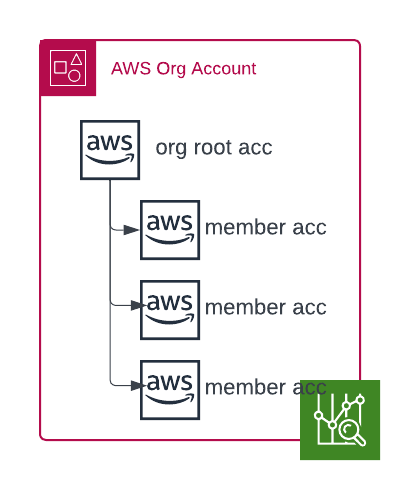

# AWS Cost Management Scripts (Work in Progress and Testing)

This repository contains Python functions that interact with the AWS Cost Management Service to retrieve and report billing information:

# Installation
`python3 -m venv .vevn`

`. .venv/bin/activate`

`python3 -m pip install -r requirements`

# Execution
Ensure you have an environment variable named AWS_PROFILE set before running the following command.

`python3 aws_billing/aws_billing.py`

`python3 aws_billing/aws_billing.py --help`

# Contributing
[Contributing](CONTRIBUTING.md)

# License
[License](LICENSE)