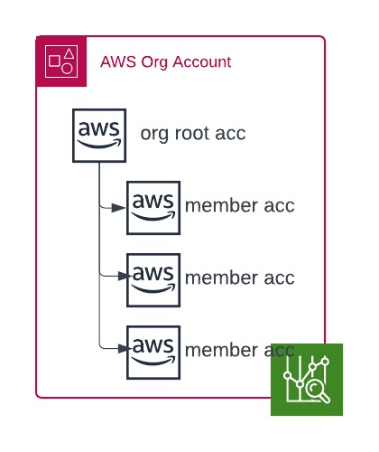

# AWS Cost Management Scripts (Work in Progress and Testing)

This repository contains Python functions that interact with the AWS Cost Management Service to retrieve and report billing information:

# Installation
`python3 -m venv .venv`

`. .venv/bin/activate`

`python3 -m pip install -r requirements.txt`

# Execution

## Graphical User Interface (Streamlit)
We have added a web-based UI for easier execution of reports across different regions.
Before starting the UI, ensure you authenticate via your terminal for each profile:
`aws login --profile kloudr-961` 
`aws login --profile kloudr-leb` 
`aws login --profile kloudr-ksa`

Then, launch the UI:
`streamlit run ui/app.py`

## Command Line Interface
Ensure you have an environment variable named AWS_PROFILE set before running the following command.

`python3 aws_billing/aws_billing.py`

`python3 aws_billing/aws_billing.py --help`

# Contributing
[Contributing](CONTRIBUTING.md)

# License
[License](LICENSE)